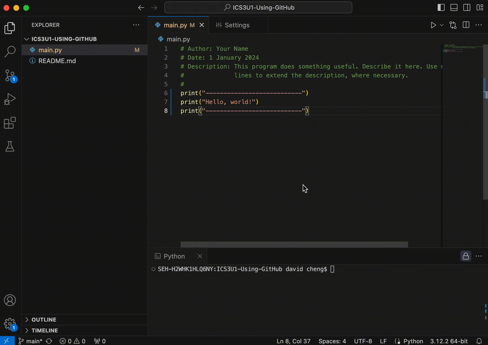
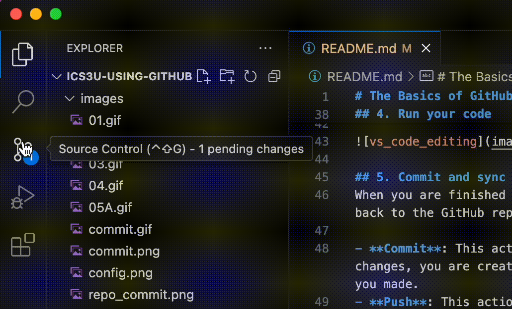
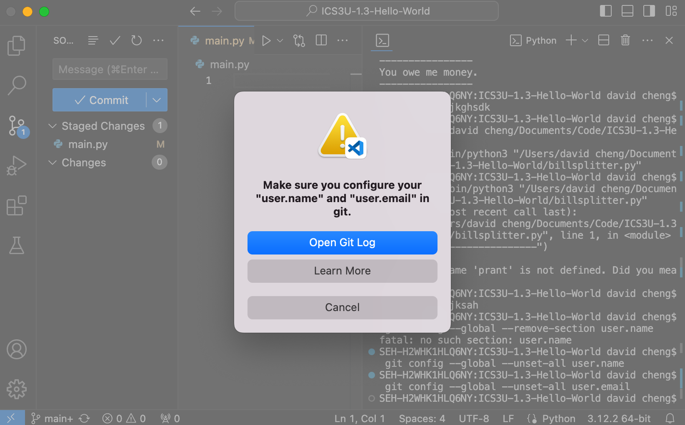
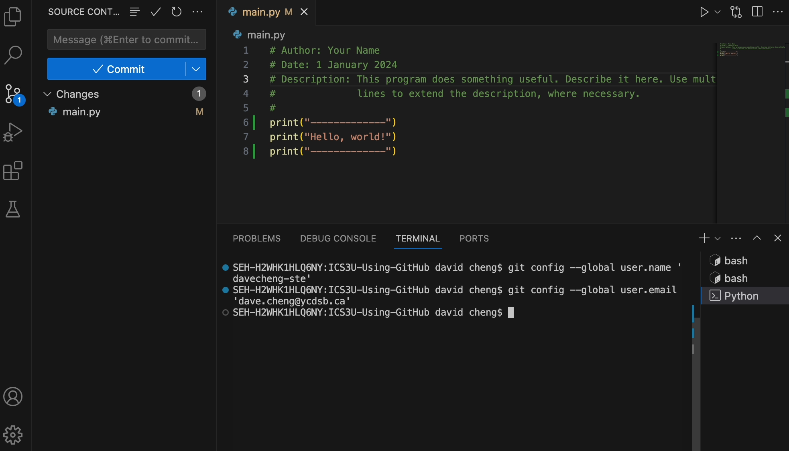
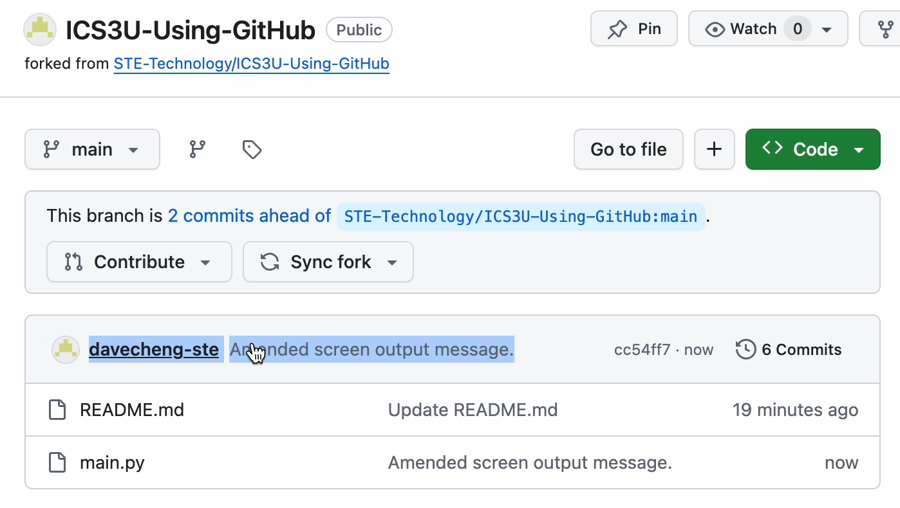
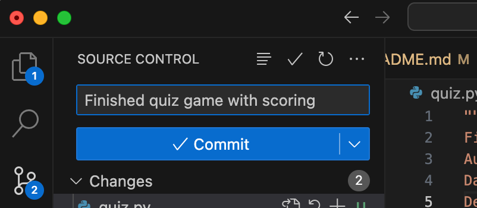
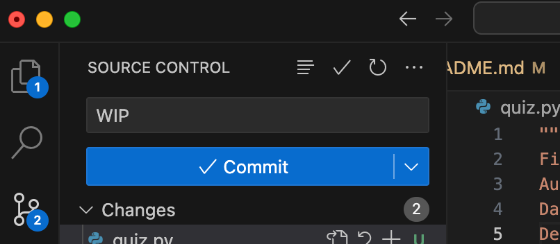
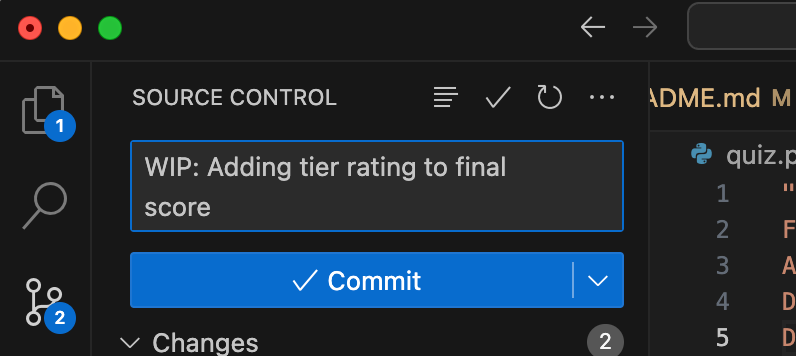

# The Basics of GitHub

Git is a distributed Version Control System (VCS), which means it is a useful tool for easily tracking changes to your code, collaborating, and sharing. With Git you can track the changes you make to your project so you always have a record of what you’ve worked on and can easily revert back to an older version if need be. It also makes working with others easier—groups of people can work together on the same project and merge their changes into one final source.

These are instructions on how to work with GitHub. Before proceeding, make sure that you have the following setup:

- Your local development environment properly set up with Visual Studio Code, Java JDK, Extension Pack for Java, and Git installed.
- An account on GitHub set up with your @ycdsbk12.ca account.
- Your GitHub username and email address.

## <a name='TableofContents'></a>Table of Contents

<!-- vscode-markdown-toc -->
* [Table of Contents](#TableofContents)
* [Step 1: Fork the repository (optional)](#Step1Forktherepositoryoptional)
* [Step 2: Clone your repository to Visual Studio Code](#Step2:CloneyourrepositorytoVisualStudioCode)
* [Step 3: Edit your code](#Step3:Edityourcode)
* [Step 4: Run your code](#Step4:Runyourcode)
* [Step 5: Commit and sync your changes to GitHub](#Step5:CommitandsyncyourchangestoGitHub)
	* [First Commit? How to fix the GitHub configuration error](#FirstCommitHowtofixtheGitHubconfigurationerror)
* [Step 6: Verify update on GitHub (optional)](#Step6:VerifyupdateonGitHuboptional)
* [Writing Meaningful Commit Messages](#WritingMeaningfulCommitMessages)
	* [Examples of Commit Messages](#ExamplesofCommitMessages)
		* [Example: Completion](#Example:Completion)
		* [Example: Work in Progress](#Example:WorkinProgress)
		* [Example: Work in Progress - Informative](#Example:WorkinProgress-Informative)
* [Terminology of GitHub](#TerminologyofGitHub)
	* [Repositories](#Repositories)
	* [Cloning](#Cloning)
	* [Committing and pushing](#Committingandpushing)
	* [Branches](#Branches)
	* [Forks](#Forks)
	* [Pull requests](#Pullrequests)
	* [Issues](#Issues)

<!-- vscode-markdown-toc-config
	numbering=false
	autoSave=true
	/vscode-markdown-toc-config -->
<!-- /vscode-markdown-toc -->


## <a name='Step1Forktherepositoryoptional'></a>Step 1: Fork the repository (optional)
Forking a repository makes your own copy of it. Your forked repo will be stored in your own personal GitHub account.

If you're using a repository (or "repo") provided to you from GitHub Classroom, you can **skip this step**.


## <a name='Step2:CloneyourrepositorytoVisualStudioCode'></a>Step 2: Clone your repository to Visual Studio Code
Cloning your repo to Visual Studio Code creates a local, offline copy on your machine. To do this, follow these steps:

1. From the GitHub page for the repo, copy the URL for your fork to the clipboard:


2. Next, open Visual Studio Code. Go to **File** > **New Window** in the menu bar.
3. In the new Visual Studio Code window, click on **Clone Git Repository**.
4. Paste the URL from the clipboard into the prompt and press return.
5. You'll be asked where you want to save this cloned folder. (In the example below, I've chosen my *Documents* folder.)
6. Open your cloned repository.


## <a name='Step3:Edityourcode'></a>Step 3: Edit your code
The Explorer sidebar on the left shows all of the files in the current repo. Begin editing your code by opening the appropriate file in the code editor:


## <a name='Step4:Runyourcode'></a>Step 4: Run your code
Click on the *Run* icon in the top-right corner of the code editor to run your code. A terminal window will appear with your output.

NOTE: Try not to confuse the terminal's command prompt with the actual code output. The command prompt will usually have the hostname of your machine and your username.



## <a name='Step5:CommitandsyncyourchangestoGitHub'></a>Step 5: Commit and sync your changes to GitHub
When you are finished editing your code, you will want to Commit and Sync your changes back to the GitHub repo online. 

- **Commit**: This action records a *snapshot* of your changes. When you commit changes, you are creating a *checkpoint* with a *short message* describing the changes you made.
- **Push**: This action uploads the committed changes from your local repository to the remote repository on GitHub.
- **Pull**: This action downloads any new changes from the remote repository since the last sync or clone. New changes are merged with your local repository, warning you of any conflicts.
- **Sync**: This action is combination of all of the above. A *Sync* action will commit and push local changes to the remote repo, as well as pull any new changes from the remote repository.

To Commit and Sync changes, do the following:

1. In the sidebar, click on the **Source Control** view.
2. You should see a list of **Changes** that will be a part of this Commit action. Think of it as a *snapshot of changes*.
3. Type a short message in the **Message** box, describing the changes made. *IMPORTANT: YOU **MUST** TYPE A COMMIT MESSAGE!*
4. Click on **Commit** to record the snapshot.
5. Next, click on **Sync** — a combined **Push** and **Pull** action — to push the changes to the GitHub repo online.



Note that we have yet to deal with other situations including merging and resolving conflicts. More to come.

### <a name='FirstCommitHowtofixtheGitHubconfigurationerror'></a>First Commit? How to fix the GitHub configuration error
When you try to do your first GitHub commit in Visual Studio Code, you will get a GitHub configuration error like this:



To fix this, enter the following two commands into the terminal, replacing `your_github_username` and `your_github_account_email` with your own:

```shell
git config --global user.name 'your_github_username'
```
and
```shell
git config --global user.email 'your_github_account_email'
```

For example, my personal setup would look like:

```shell
git config --global user.name 'davecheng-ste'
git config --global user.email 'dave.cheng@ycdsb.ca'
```

And entered into the terminal, it looks like:



Next, try to run the Commit and Sync actions again. You should then be directed to a web browser to authenticate your GitHub username and password for Visual Studio Code.

This setup should only be necessary on your first Commit action.  

## <a name='Step6:VerifyupdateonGitHuboptional'></a>Step 6: Verify update on GitHub (optional)
Finally, you can check the repository online (i.e. in the cloud) to verify that your latest Commit changes are reflected:




<br><br>

## <a name='WritingMeaningfulCommitMessages'></a>Writing Meaningful Commit Messages

Commit messages are a way to communicate changes made to the codebase. They should be clear and informative to help others (including your future self) understand what was done.

**Start with a Brief Summary.** A one-line commit message should be a concise summary of what the commit accomplishes. It should be clear and descriptive, giving an overview of the changes.

**Use Descriptive Language** Use descriptive language in your commit messages. Instead of just saying "done", they should specify what was done. For example, "*Implemented a function to calculate factorial*" or "*Fixed a bug in the loop condition*".

**Indicate Work in Progress (WIP)** If you're still working on a feature or a fix, use "WIP" in the commit message. For example, "*WIP: Adding input validation for user age*".

**Indicate Completion** When you finish working something, clearly indicate it in the commit message. You can use phrases like "*Completed*", "*Finished*", or "*Implemented fully*". For example, "*Completed user authentication feature*".

**Include Details for Revisions/Changes** If you need to make revisions or changes based on feedback, you should mention it in the commit message along with what changes were made. For example, "*Revised function logic based on feedback*" or "*Updated variable names for clarity*".

### <a name='ExamplesofCommitMessages'></a>Examples of Commit Messages
#### <a name='Example:Completion'></a>Example: Completion
This message would indicate the program is finished and ready for general use, marking, or feedback:

<div style="text-align:center">
    
</div>

#### <a name='Example:WorkinProgress'></a>Example: Work in Progress
If you are the only one working on the repo, it may suffice just to remind yourself (and me) that the code is a *work in progress* (or "*WIP*", for short) and not yet ready for review:

<div style="text-align:center">
    
</div>

#### <a name='Example:WorkinProgress-Informative'></a>Example: Work in Progress - Informative
This message is a little more informative about the WIP, useful if there are others working on the same codebase:

<div style="text-align:center">
    
</div>


<br><br>

## <a name='TerminologyofGitHub'></a>Terminology of GitHub 
### <a name='Repositories'></a>Repositories
A repository is where your project work happens--think of it as your project folder. It contains all of your project’s files and revision history. You can work within a repository alone or invite others to collaborate with you on those files.

### <a name='Cloning'></a>Cloning
When a repository is created with GitHub, it’s stored remotely in the cloud. You can clone a repository to create a local copy on your computer and then use Git to sync the two. 

### <a name='Committingandpushing'></a>Committing and pushing
Committing and pushing are how you can add the changes you made on your local machine to the remote repository in GitHub. You can make a commit when you have made changes to your project that you want to “checkpoint.” You can also add a helpful commit message to remind yourself or your teammates what work you did (e.g., “Added a README with information about our project”).

### <a name='Branches'></a>Branches
You can use branches on GitHub to isolate work that you do not want merged into your final project just yet. Branches allow you to develop features, fix bugs, or safely experiment with new ideas in a contained area of your repository. Typically, you might create a new branch from the default branch of your repository, `main`. This makes a new working copy of your repository for you to experiment with. Once your new changes have been reviewed by a teammate, or you are satisfied with them, you can merge your changes into the default branch of your repository.

### <a name='Forks'></a>Forks
A fork is another way to copy a repository, but is usually used when you want to contribute to someone else’s project. Forking a repository allows you to freely experiment with changes without affecting the original project.

### <a name='Pullrequests'></a>Pull requests
When working with branches, you can use a pull request to tell others about the changes you want to make and ask for their feedback. Once a pull request is opened, you can discuss and review the potential changes with collaborators and add more changes if need be. You can add specific people as reviewers of your pull request which shows you want their feedback on your changes! Once a pull request is ready-to-go, it can be merged into your main branch.

### <a name='Issues'></a>Issues
Issues are a way to track enhancements, tasks, or bugs for your work on GitHub. Issues are a great way to keep track of all the tasks you want to work on for your project and let others know what you plan to work on. 
