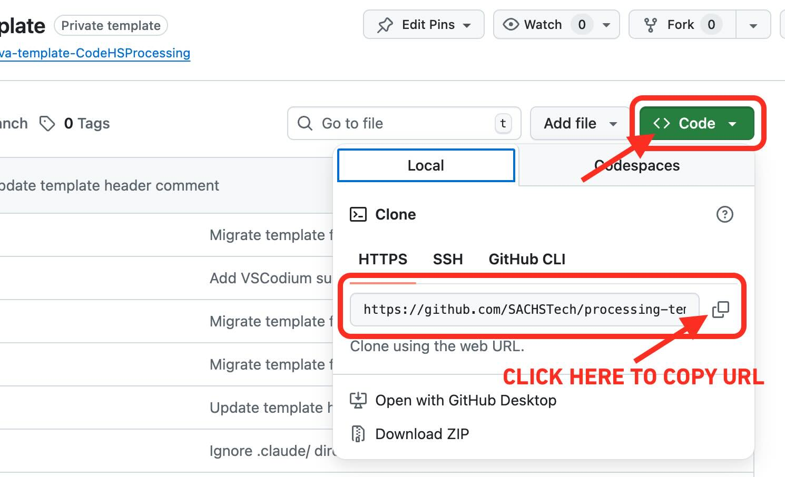
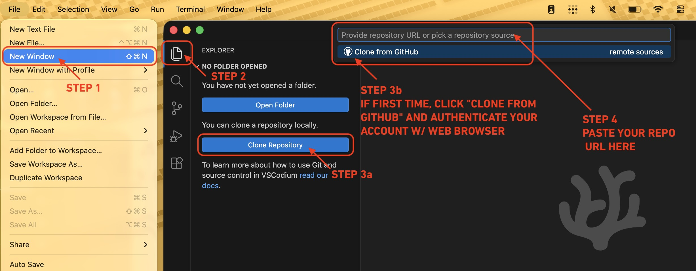
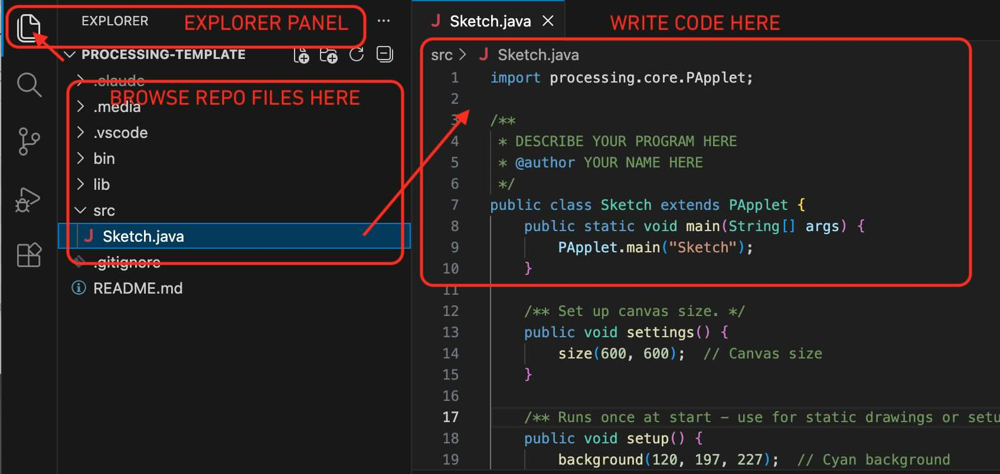
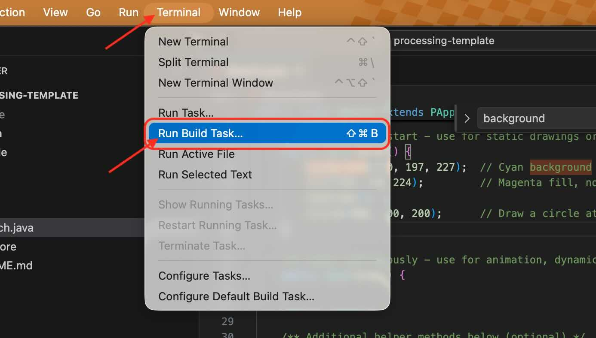
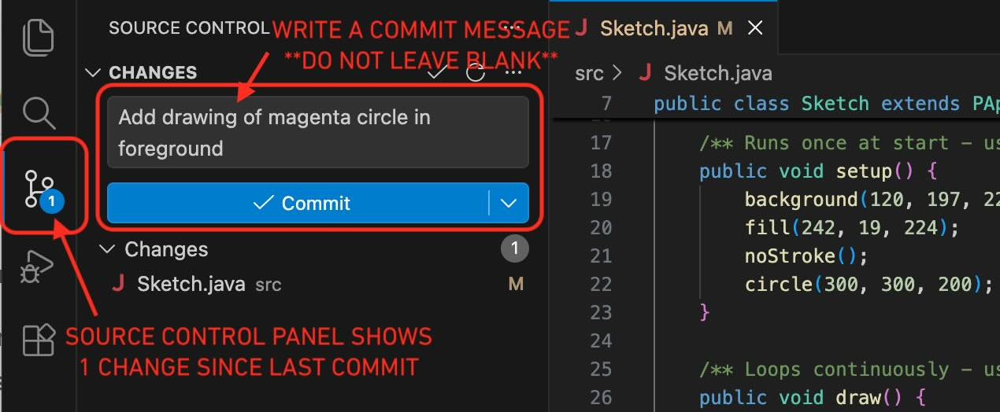
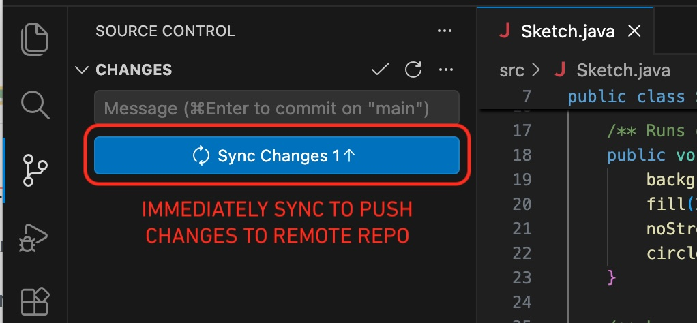
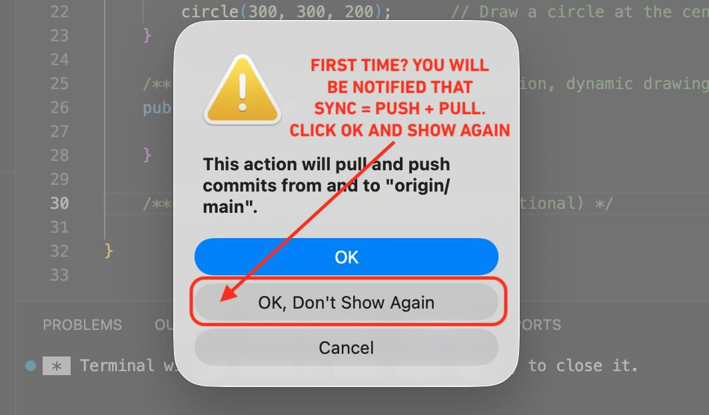
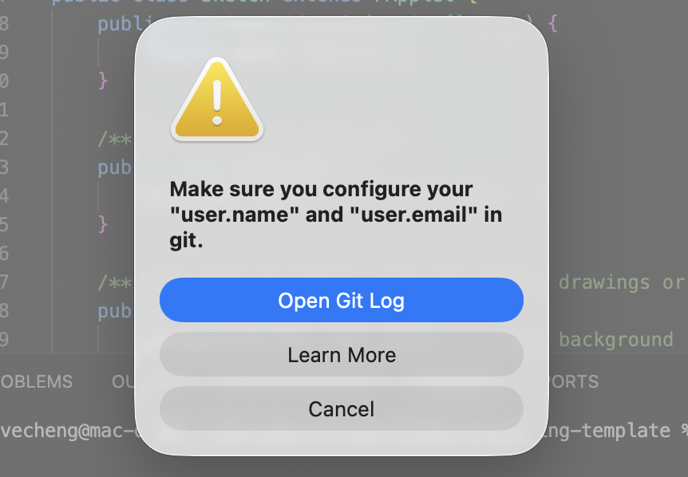
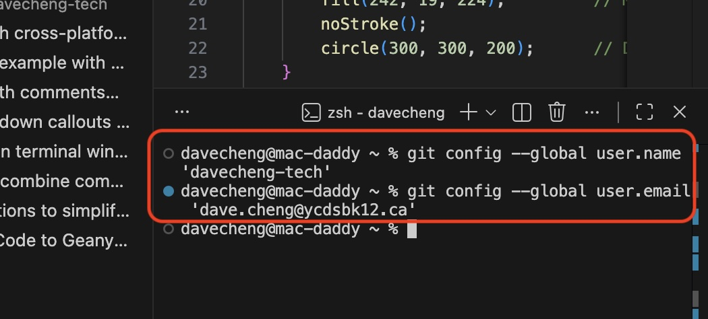
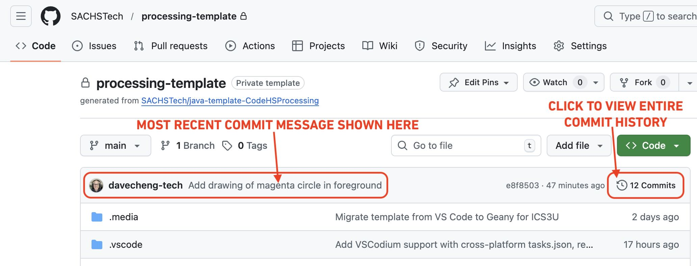

# Using GitHub

This is a guide on how to work with GitHub repositories (or "repos"). In particular, we'll look at how to clone a remote repo to your local machine, make changes, and keep everything in sync.

Before proceeding, make sure that you have the following installed (see the *Installation Check* section below):

- VSCodium
- Git
- Java Development Kit (JDK)

You will also need:

- An account on GitHub set up with your @ycdsbk12.ca account.
- Your GitHub username and email address.

## Installation Check

### VSCodium
Download VSCodium from https://vscodium.com/#install. Click "Download latest release" at the top, then scroll down to find the release for your operating system (Windows, macOS, Linux) and processor architecture (x86 for Intel, ARM for Apple Silicon or Snapdragon).

### Git
Download and install Git from https://git-scm.com/book/en/v2/Getting-Started-Installing-Git. Read the instructions carefully for your operating system.

### Java Development Kit (JDK)
Download the JDK from https://www.oracle.com/java/technologies/downloads/#java21. Choose the version appropriate for your operating system and processor architecture.

## Table of Contents

- [Installation Check](#installation-check)
  - [VSCodium](#vscodium)
  - [Git](#git)
  - [Java Development Kit (JDK)](#java-development-kit-jdk)
- [Setup a New Repository with VSCodium](#setup-a-new-repository-with-vscodium)
  - [Step 1: Clone your repository to VSCodium](#step-1-clone-your-repository-to-vscodium)
  - [Step 2: Edit your code](#step-2-edit-your-code)
  - [Step 3: Run your code](#step-3-run-your-code)
  - [Step 4: Commit and sync your changes to GitHub](#step-4-commit-and-sync-your-changes-to-github)
    - [First Commit? How to fix the GitHub configuration error](#first-commit-how-to-fix-the-github-configuration-error)
  - [Step 5: Verify update on GitHub (optional)](#step-5-verify-update-on-github-optional)
- [Writing Meaningful Commit Messages](#writing-meaningful-commit-messages)
  - [Examples of Commit Messages](#examples-of-commit-messages)
    - [Example: Completion](#example-completion)
    - [Example: Work in Progress - Lazy](#example-work-in-progress---lazy)
    - [Example: Work in Progress - Informative](#example-work-in-progress---informative)
    - [Bad Example: Vague Commit Message](#bad-example-vague-commit-message)
- [Terminology of GitHub](#terminology-of-github)
  - [Repository](#repository)
  - [Cloning](#cloning)
  - [Commit](#commit)
  - [Staging](#staging)
  - [Push](#push)
  - [Pull](#pull)
  - [Sync](#sync)
  - [Branches](#branches)
  - [Forks](#forks)
  - [Pull Request](#pull-request)
- [Quick Daily Workflow (Cheat Sheet)](#quick-daily-workflow-cheat-sheet)
  - [1. Pull the latest changes from GitHub](#1-pull-the-latest-changes-from-github)
  - [2. Resolve Merge Conflicts (if any)](#2-resolve-merge-conflicts-if-any)
  - [3. Edit your code in VSCodium](#3-edit-your-code-in-vscodium)
  - [4. Commit with a clear, short message](#4-commit-with-a-clear-short-message)
  - [5. Push/Sync your changes back to GitHub](#5-pushsync-your-changes-back-to-github)

## Setup a New Repository with VSCodium

### Step 1: Clone your repository to VSCodium
Cloning your repo to VSCodium creates a local, offline copy on your machine. To do this, follow these steps:

1. From the GitHub page for the repo, click the green **Code** button and copy the HTTPS URL to the clipboard:



2. Next, open VSCodium. Go to **File** > **New Window** in the menu bar.
3. In the new VSCodium window, click on **Clone Repository**.
4. Paste the URL from the clipboard into the prompt and press return.
5. You'll be asked where you want to save this cloned folder. (I'd suggest staying organized by putting in your Documents folder, or a specific folder for this class.)
6. Open your cloned repository.



### Step 2: Edit your code
The Explorer sidebar on the left shows all of the files in the current repo. Begin editing your code by opening the appropriate file in the code editor:



### Step 3: Run your code
Run your code by clicking on **Terminal** > **Run Build Task** in the menu bar.

For Processing graphics, a new graphics window will appear. Any console output (e.g., `System.out.println()` commands or errors) will show up in the VSCodium terminal.

NOTE: Try not to confuse the terminal's command prompt with the actual code output. The command prompt will usually have the hostname of your machine and your username.



PRO TIP: Work quickly by using the keyboard shortcut for Run Build Task, **Command**+**Shift**+**B** (macOS) or **Control**+**Shift**+**B** (Windows).

### Step 4: Commit and sync your changes to GitHub
When you are finished editing your code, you will want to Commit and Sync your changes back to the GitHub repo online.

- **Commit**: This action records a *snapshot* of your changes. When you commit changes, you are creating a *checkpoint* with a *short message* describing the changes you made.
- **Push**: This action uploads the committed changes from your local repository to the remote repository on GitHub.
- **Pull**: This action downloads any new changes from the remote repository since the last sync or clone. New changes are merged with your local repository, warning you of any conflicts.
- **Sync**: This action is a combination of Push and Pull. A *Sync* action pushes your committed local changes to the remote repo, and pulls any new changes from the remote repository.

> **Quick Analogy**
> - **Commit** = Save a checkpoint locally (like saving in a video game).
> - **Push** = Send your checkpoint to the cloud (GitHub).
> - **Pull** = Bring down the latest checkpoints from the cloud.
> - **Sync** = Do both Push and Pull in one step.

To Commit and Sync changes, do the following:

1. In the sidebar, click on the **Source Control** view.
2. You should see a list of **Changes** that will be a part of this Commit action. Think of it as a *snapshot of changes*.
3. Type a short message in the **Message** box, describing the changes made. *IMPORTANT: DO NOT LEAVE THIS BLANK!*
4. Click on **Commit** to record the snapshot.



5. Next, click on **Sync Changes** (a combined **Push** and **Pull** action) to push the changes to the GitHub repo online.



The first time you sync, you may see a dialog confirming the sync action is a combined push and pull. Click **OK, Don't Show Again**.



Note that we have yet to deal with other situations including merging and resolving conflicts. If you run into these issues, come see me in class.

#### First Commit? How to fix the GitHub configuration error
When you try to do your first GitHub commit in VSCodium, you will get a GitHub configuration error like this:



To fix this, enter the following two commands into the terminal, replacing `your_github_username` and `your_github_account_email` with your own:

```shell
git config --global user.name 'your_github_username'
```
and
```shell
git config --global user.email 'your_github_account_email'
```

For example, my personal setup would look like:

```shell
git config --global user.name 'davecheng-tech'
git config --global user.email 'dave.cheng@ycdsb.ca'
```

And entered into the terminal, it looks like:



Next, try to run the Commit and Sync actions again. You should then be directed to a web browser to authenticate your GitHub account.

This setup should only be necessary on your first Commit action.

### Step 5: Verify update on GitHub (optional)
Finally, you can check the repository online (i.e. in the cloud) to verify that your latest Commit changes are reflected:




<br><br>

## Writing Meaningful Commit Messages

Commit messages are a way to communicate changes made to the codebase. They should be clear and informative to help others (including your future self) understand what was done.

**Start with a Brief Summary.** A one-line commit message should be a concise summary of what the commit accomplishes. It should be clear and descriptive, giving an overview of the changes.

**Use Descriptive Language** Use descriptive language in your commit messages. Instead of just saying "done", they should specify what was done. For example, "*Implement a function to calculate factorial*" or "*Fix a bug in the loop condition*".

**Indicate Work in Progress (WIP)** If you're still working on a feature or a fix, use "WIP" in the commit message. For example, "*WIP - Add input validation for user age*".

**Indicate Completion** When you finish working something, clearly indicate it in the commit message. You can use phrases like "*Complete*" or "*Finish*". For example, "*Complete user authentication feature*".

**Include Details for Revisions/Changes** If you need to make revisions or changes based on feedback, you should mention it in the commit message along with what changes were made. For example, "*Revise function logic based on feedback*" or "*Update variable names for clarity*".

### Examples of Commit Messages
#### Example: Completion
This message would indicate the program is finished and ready for general use, marking, or feedback:

```
Complete user login feature with input validation
```

#### Example: Work in Progress - Lazy
If you are the only one working on the repo, it may suffice just to remind yourself (and me) that the code is a *work in progress* (or "*WIP*", for short) and not yet ready for review:

```
WIP
```

#### Example: Work in Progress - Informative
This message is a little more informative about the WIP, useful if there are others working on the same codebase:

```
WIP - Add input validation for user age field
```

#### Bad Example: Vague Commit Message
Avoid messages like these — they don't explain what was changed and won't help you (or teammates) later.

```
update stuff
fix code
done
```

<br><br>

## Terminology of GitHub
### Repository
A repository is where your project work happens. Think of it as your project folder. It contains all of your project's files and revision history. You can work within a repository alone or invite others to collaborate with you on those files.

### Cloning
When a repository is created with GitHub, it's stored remotely in the cloud. You can clone a repository to create a local copy on your computer and then use Git to sync the two.

### Commit
A commit in Git is a snapshot of the changes in a repository at a specific point in time. It records modifications along with a **commit message** describing the update. Each commit creates a unique identifier (hash) that allows you to track and revert changes if needed. A commit only affects the local repository until it is pushed to a remote repository like GitHub.

### Staging
Staging is the process of preparing changes for a commit. When you edit files in a repository, they start as untracked or modified but are not yet part of the commit history. Using `git add`, you can stage specific changes, marking them as ready to be included in the next commit.

In VSCodium, when you commit changes through the built-in Git interface, all modified files are automatically staged by default. However, you can manually select which files to stage or unstage in the Source Control panel before committing.


### Push
A **push** sends committed changes from your local repository to a remote repository. This updates the remote repository with the latest changes from your local machine, making them available to collaborators.

### Pull
A **pull** fetches and merges changes from a remote repository into your local repository. This ensures that your local branch is up to date with the latest changes made by others. Running `git pull` is equivalent to running `git fetch` (to download changes) followed by `git merge` (to integrate them).

### Sync
In VSCodium, a sync operation performs both a pull and a push in one step.

> **Note for ICS3U and ICS4U Students:**
> Branches, Forks, and Pull Requests are powerful collaboration tools, but you will not usually need them in this course. Feel free to skim below or return later.

### Branches
You can use branches on GitHub to isolate work that you do not want merged into your final project just yet. Branches allow you to develop features, fix bugs, or safely experiment with new ideas in a contained area of your repository. Typically, you might create a new branch from the default branch of your repository, `main`. This makes a new working copy of your repository for you to experiment with. Once your new changes have been reviewed by a teammate, or you are satisfied with them, you can merge your changes into the default branch of your repository.

### Forks
A fork is another way to copy a repository, but is usually used when you want to contribute to someone else's project. Forking a repository allows you to freely experiment with changes without affecting the original project.

### Pull Request
When working with branches, you can use a pull request to tell others about the changes you want to make and ask for their feedback. Once a pull request is opened, you can discuss and review the potential changes with collaborators and add more changes if need be. You can add specific people as reviewers of your pull request which shows you want their feedback on your changes! Once a pull request is ready-to-go, it can be merged into your main branch.


<br><br>

## Quick Daily Workflow (Cheat Sheet)
When working with GitHub in an IDE, it is best to follow this structured workflow every session.

### 1. Pull the latest changes from GitHub
- This ensures your local copy is up to date.
- If GitHub has updates, Git may need to **merge** them into your code.

### 2. Resolve Merge Conflicts (if any)
- If your edits clash with someone else's, VSCodium will highlight the conflicts.
- Choose which code to keep, then **save** and **commit** the resolution.

### 3. Edit your code in VSCodium
Remember to regularly save your work to prevent losing progress.

### 4. Commit with a clear, short message
But remember, a commit only saves your changes locally. They are not yet uploaded to GitHub.

### 5. Push/Sync your changes back to GitHub
Push your committed changes back to the cloud.

> Tip: If you always pull first, then edit and commit, merges will be smaller and easier to manage.
